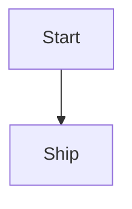

# Source Fidelity Fixture

3. Keep the original ordered-list number
4. Keep the next original ordered-list number

- Parent bullet
  - Child bullet with [[Wiki Target|wiki alias]]
  - [ ] Nested task with ==highlight==
    1. Nested ordered item

| Model | License | Notes |
|-------|:-------:|------:|
| Small | Apache-2.0 | Uses `A | B` safely |
| Large | CC-BY-NC-4.0 | Multi<br>line |

> [!warning]- Fixture callout
> This callout body has **bold** text.
> It also has [a link](https://example.test).

```dart
void main() {
  print('hello');
}
```



$$
E = mc^2
$$

<div class="raw-note">
This HTML must stay raw.
</div>

[docs]: https://example.test "Reference title"

[^details]: Footnote definition
  with a continuation line

%%
Obsidian comment that should stay raw.
%%

^block-anchor
